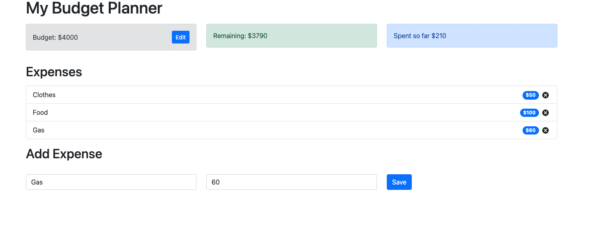

# React Budget Planner

This is a basic budget app. It allows the user to create and edit a budget, add and delete expenses. This project was created using React and Bootstrap.

## Table of contents

- [React Budget Planner](#react-budget-planner)
  - [Table of contents](#table-of-contents)
  - [Overview](#overview)
    - [Screenshot](#screenshot)
    - [Links](#links)
  - [My process](#my-process)
    - [Built with](#built-with)
    - [Continued development](#continued-development)
  - [Author](#author)

## Overview

### Screenshot

### Links

- Solution URL: [Add solution URL here](https://your-solution-url.com)
- Live Site URL: [Add live site URL here](https://your-live-site-url.com)

## My process

### Built with

- React
- Bootstrap
- JS
- [React](https://reactjs.org/) - JS library
- [Bootstrap](https://getbootstrap.com/) - For styles

### Continued development

Continue focusing on developing efficient ways to create components. Start working with Redux to improve state management. 

## Author

- Website - [Mick Maratta](https://www.mickmaratta.me)
- GitHub - [@mickmaratta](https://github.com/mickmaratta)
